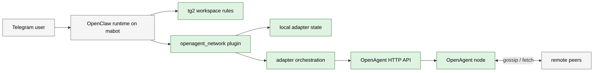

# System Overview

This document is the top-level architecture baseline for `openclaw-P2P`.
It answers three questions:

- what the system is made of
- what has already been proven to work
- what still has open gaps

## Runtime Diagram

## Module Status Matrix

| Module | Scope | State | Real-world proof | Main open gaps |
| --- | --- | --- | --- | --- |
| A. Go OpenAgent Core | Node, fetch protocol, `/v1/*` APIs | partial | Historical publish/fetch verified; current main-bot flow uses it successfully | `/v1/tasks` intermittently returned `502` during acceptance |
| B. Adapter Orchestration | Publish/read business flow | done | Task, interest, cancel, my, detail all exercised from Telegram | Needs follow-up hardening around read path edge cases |
| C. OpenClaw Tool Plugin | `openagent_network` tool surface | partial | Tool is used by `tg2` in real Telegram sessions | `read_detail` handle path is not single-shot; stateful calls still use `default` too often |
| D. Local State Store | Pending/outgoing/events persistence | partial | Draft, confirm, cancel, and publication records verified | Isolation depends on upstream `sessionKey` quality |
| E. Telegram Bridge Runtime | Direct Telegram bridge path | partial | Historical/local coverage exists | Not the primary production path currently under test |
| F. Agent Workspace Templates | `tg2` behavior and tool-choice rules | done | Real Telegram acceptance proved the new behavior works | Needs regression packaging and possible multi-workspace expansion |
| G. Acceptance and Ops Tooling | SSH checks, runbooks, evidence capture | done | Used throughout the current acceptance run | Needs formal spec packaging and repeatable regression workflow |

## External Dependencies

These are intentionally outside the formal repo module boundary:

| External system | Why it matters | Why it is not a formal module yet |
| --- | --- | --- |
| `mabot` OpenClaw runtime | Hosts the real bot, gateway, pairing, workspace loading | Mostly runtime configuration and host state |
| Telegram real users and network | Provide real inbound/outbound traffic | Not repo-owned |
| `cloud1` and other peers | Needed for cross-node verification | Separate machine and deployment context |

## Proven End-to-End Flows

The following were observed in real Telegram acceptance against `tg2`:

- task draft
- task confirm and publish
- interest draft
- interest confirm and publish
- draft cancel without publish
- `my` readback
- `detail` readback

The `detail` path is only marked as functionally proven. It still contains an
implementation defect because handle-based requests first fail once and then
recover using a full `detail_ref`.
